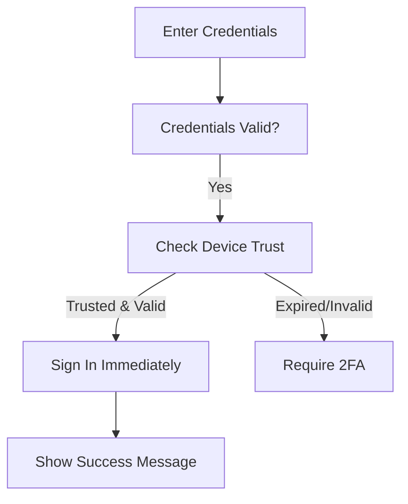

# 2FA Trusted Devices - 30-Day Remember Feature

## 🔐 Overview

The TelAgri Bank Dashboard now supports **trusted device management** for 2FA verification. Users can mark their devices as "trusted" during the 2FA process, allowing them to skip 2FA verification for **30 days** on that specific device.

## 🌟 Features

### ✅ **Smart Device Recognition**
- **Device fingerprinting** using browser characteristics
- **Secure hashing** of device signatures
- **Cross-session persistence** using database storage
- **Automatic cleanup** of expired trusted devices

### ✅ **Enhanced User Experience**
- **Optional checkbox** during 2FA: "Remember this device for 30 days"
- **Automatic sign-in** for trusted devices
- **Clear device descriptions** (e.g., "Chrome on macOS")
- **Visual indicators** for current device status

### ✅ **Security & Privacy**
- **30-day expiration** with automatic cleanup
- **User control** - can remove trusted devices anytime
- **Device-specific** - works only on the exact browser/device
- **Secure storage** with Row Level Security (RLS)

## 🚀 How to Use

### **For Users (Banking Staff)**

#### **1. Enable Trusted Device During 2FA**
1. Sign in with email and password
2. Enter your 6-digit 2FA code
3. ✅ **Check "Remember this device for 30 days"**
4. Click "Verify Code"
5. Device will be trusted for 30 days

#### **2. Automatic Sign-in on Trusted Devices**
1. Visit the dashboard on a trusted device
2. Enter email and password
3. **No 2FA required** - automatic sign-in
4. See notification: "Trusted device recognized"

#### **3. Manage Trusted Devices**
- Access via **Settings** or **Profile** menu
- View all trusted devices with details:
  - Device type (Chrome on macOS, etc.)
  - Days remaining until expiration
  - Last used date
- **Remove devices** manually if needed

### **For Administrators**

#### **Database Management**
```sql
-- View all trusted devices
SELECT user_email, device_info, expires_at, last_used_at 
FROM trusted_devices 
ORDER BY created_at DESC;

-- Clean up expired devices manually
SELECT cleanup_expired_trusted_devices();

-- Remove specific user's trusted devices
DELETE FROM trusted_devices WHERE user_email = 'user@example.com';
```

## 🛡️ Security Features

### **Device Fingerprinting Components**
- **Browser**: User-Agent, platform, language
- **Hardware**: Screen resolution, color depth, CPU cores
- **Capabilities**: WebGL renderer, canvas fingerprint
- **Environment**: Timezone, storage availability

### **Privacy Protection**
- **No personal data** stored in fingerprints
- **Hashed fingerprints** - not reversible
- **Local device info** - no tracking across sites
- **User consent** required for each device

### **Database Security**
```sql
-- Row Level Security ensures users only see their devices
CREATE POLICY "Users can view their own trusted devices" 
ON trusted_devices FOR SELECT 
USING (user_email = auth.jwt() ->> 'email');
```

## 🔧 Technical Implementation

### **Component Structure**
```
src/
├── lib/deviceFingerprint.ts       # Device identification
├── components/
│   ├── TwoFactorVerification.tsx  # Enhanced with checkbox
│   └── TrustedDevicesManager.tsx  # Device management UI
└── pages/Auth.tsx                 # Trust check during login

supabase/
├── migrations/add_trusted_devices.sql  # Database schema
└── functions/verify-2fa-code/          # Enhanced verification
```

### **Database Schema**
```sql
CREATE TABLE trusted_devices (
  id uuid PRIMARY KEY DEFAULT gen_random_uuid(),
  user_email text NOT NULL,
  device_fingerprint text NOT NULL,
  device_info jsonb NOT NULL DEFAULT '{}',
  expires_at timestamptz NOT NULL,
  created_at timestamptz DEFAULT now(),
  last_used_at timestamptz DEFAULT now(),
  UNIQUE (user_email, device_fingerprint)
);
```

### **API Integration**
```typescript
// Check if device is trusted
const { data: isTrusted } = await supabase.rpc('is_device_trusted', {
  p_user_email: email,
  p_device_fingerprint: fingerprint
});

// Add trusted device
const { data: deviceId } = await supabase.rpc('add_trusted_device', {
  p_user_email: email,
  p_device_fingerprint: fingerprint,
  p_device_info: deviceInfo
});
```

## 🔄 Workflow

### **First-time Login (New Device)**
```mermaid
graph TD
    A[Enter Credentials] --> B[Credentials Valid?]
    B -->|Yes| C[Check Device Trust]
    C -->|Not Trusted| D[Send 2FA Code]
    D --> E[Enter 2FA Code]
    E --> F[Show "Remember Device" Option]
    F -->|Checked| G[Verify & Save Device]
    F -->|Unchecked| H[Verify Only]
    G --> I[Sign In Complete]
    H --> I
```

### **Return Login (Trusted Device)**


## ⚙️ Configuration

### **Environment Variables**
```bash
# Already configured in existing Supabase setup
VITE_SUPABASE_URL=https://your-project.supabase.co
VITE_SUPABASE_ANON_KEY=your-anon-key
```

### **Customization Options**

#### **Trust Duration**
```sql
-- Change from 30 days to custom duration
-- In add_trusted_device function:
expires_at = now() + interval '60 days'  -- 60 days instead of 30
```

#### **Device Info Collection**
```typescript
// Customize in deviceFingerprint.ts
export const getDeviceInfo = async (): Promise<DeviceInfo> => {
  return {
    // Add/remove fields as needed
    userAgent: navigator.userAgent,
    // ... other fields
  };
};
```

## 🧪 Testing

### **Manual Testing Checklist**
- [ ] First login requires 2FA
- [ ] Checkbox appears on 2FA screen
- [ ] Checking box saves device after verification
- [ ] Return login skips 2FA on same device
- [ ] Different browser/device still requires 2FA
- [ ] Device manager shows correct devices
- [ ] Remove device function works
- [ ] Devices expire after 30 days

### **Browser Testing**
- [ ] Chrome (desktop & mobile)
- [ ] Firefox (desktop & mobile)
- [ ] Safari (desktop & mobile)
- [ ] Edge (desktop)

### **Security Testing**
- [ ] Incognito mode requires 2FA each time
- [ ] Clearing browser data removes trust
- [ ] Different user accounts are isolated
- [ ] Expired devices don't grant access

## 📊 Monitoring

### **Key Metrics to Track**
- **Trust adoption rate**: % users who enable device trust
- **2FA reduction**: Decrease in 2FA prompts for returning users
- **Device diversity**: Distribution of trusted device types
- **Security incidents**: Any unauthorized access attempts

### **Database Queries**
```sql
-- Trust adoption rate
SELECT 
  COUNT(DISTINCT user_email) as trusted_users,
  (COUNT(DISTINCT user_email) * 100.0 / 
   (SELECT COUNT(*) FROM profiles)) as adoption_rate
FROM trusted_devices;

-- Active trusted devices
SELECT COUNT(*) as active_devices
FROM trusted_devices 
WHERE expires_at > now();

-- Device type distribution
SELECT 
  device_info->>'userAgent' as device_type,
  COUNT(*) as count
FROM trusted_devices
GROUP BY device_info->>'userAgent'
ORDER BY count DESC;
```

## 🔮 Future Enhancements

### **Planned Features**
- **🌍 Location-based trust** - Additional security by location
- **📱 Push notifications** - Alert when new device is trusted
- **⏰ Custom expiration** - Let users choose 7, 30, or 60 days
- **🔍 Audit logs** - Track all trust/untrust events
- **📊 Analytics dashboard** - Usage statistics for admins

### **Advanced Security**
- **🤖 Risk scoring** - ML-based device risk assessment
- **🔒 Hardware tokens** - WebAuthn/FIDO2 integration
- **🚨 Anomaly detection** - Flag unusual login patterns
- **💾 Backup codes** - Alternative to 2FA for emergencies

---

## 🛟 Support

### **Common Issues**

**Q: Device not remembered after checking the box**
A: Ensure cookies/local storage are enabled and browser is not in incognito mode.

**Q: Still asked for 2FA on trusted device**
A: Check if device fingerprint has changed (updates, extensions, etc.).

**Q: Can't see trusted devices list**
A: Verify you have the `TrustedDevicesManager` component available in your user settings.

### **Contact**
For technical issues or feature requests, contact the TelAgri development team.

---

**🌾 TelAgri Bank Dashboard - Making agricultural finance more secure and user-friendly** 