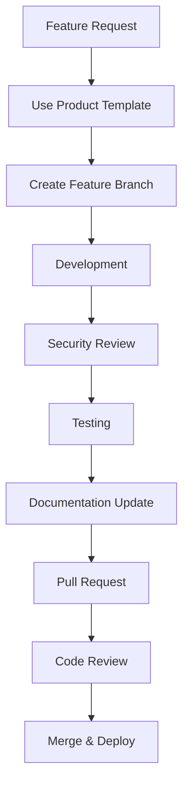

# TelAgri Bank Dashboard - Documentation

> **Comprehensive documentation for the AgriTech banking platform**

## 📋 Documentation Index

### 🛠️ Setup & Configuration

| Document | Description | Audience |
|----------|-------------|----------|
| [Environment Setup](setup/environment.md) | AWS Parameter Store configuration and environment variables | DevOps, Developers |
| [GitHub Actions Setup](setup/github.md) | CI/CD pipeline configuration and secrets management | DevOps |
| [Supabase Setup](setup/supabase.md) | Database migrations, RLS policies, and Edge Functions | Backend Developers |

### 🔒 Security

| Document | Description | Audience |
|----------|-------------|----------|
| [Security Setup Guide](security/setup.md) | Comprehensive security configuration and best practices | All Team Members |
| [2FA & Trusted Devices](security/2fa-trusted-devices.md) | Two-factor authentication implementation | Developers, QA |

### 🚀 Deployment

| Document | Description | Audience |
|----------|-------------|----------|
| [AWS Deployment Guide](deployment/aws.md) | Complete AWS infrastructure setup with CDK | DevOps, Infrastructure |
| [Deployment Summary](deployment/summary.md) | Overview of deployment process and environments | All Team Members |

### 💻 Development

| Document | Description | Audience |
|----------|-------------|----------|
| [PWA Development](development/pwa.md) | Progressive Web App features and implementation | Frontend Developers |
| [Product Templates](development/product-templates.md) | Templates for feature requests and change management | Product Managers |
| [Project Architecture](development/project-prompt.md) | Detailed project structure and technical decisions | All Developers |

### 📚 API Documentation

| Document | Description | Audience |
|----------|-------------|----------|
| [Supabase Edge Functions](../supabase/functions/) | Server-side API endpoints and business logic | Backend Developers |
| [Database Schema](../supabase/migrations/) | Database structure and migration history | Backend Developers |

## 🎯 Quick Navigation

### For New Team Members
1. Start with [Project Architecture](development/project-prompt.md)
2. Set up your environment using [Environment Setup](setup/environment.md)
3. Review [Security Setup Guide](security/setup.md)
4. Follow [Development Workflow](#development-workflow)

### For DevOps Engineers
1. [AWS Deployment Guide](deployment/aws.md)
2. [GitHub Actions Setup](setup/github.md)
3. [Environment Setup](setup/environment.md)
4. [Security Setup Guide](security/setup.md)

### For Product Managers
1. [Product Templates](development/product-templates.md)
2. [Project Architecture](development/project-prompt.md)
3. [Deployment Summary](deployment/summary.md)

### For Security Auditors
1. [Security Setup Guide](security/setup.md)
2. [2FA & Trusted Devices](security/2fa-trusted-devices.md)
3. [Environment Setup](setup/environment.md) (Parameter Store encryption)

## 🔄 Development Workflow



## 📊 Documentation Standards

### Writing Guidelines
- Use clear, concise language
- Include code examples where applicable
- Provide step-by-step instructions
- Add troubleshooting sections
- Keep security considerations prominent

### File Organization
```
docs/
├── README.md                    # This index file
├── setup/                       # Initial setup and configuration
├── security/                    # Security guides and best practices
├── deployment/                  # Deployment and infrastructure
├── development/                 # Development guides and templates
└── api/                        # API documentation (future)
```

### Maintenance
- Review documentation quarterly
- Update after major feature releases
- Validate all links and examples
- Keep security information current

## 🔗 External Resources

- [Supabase Documentation](https://supabase.com/docs)
- [AWS CDK Documentation](https://docs.aws.amazon.com/cdk/)
- [React + TypeScript Best Practices](https://react-typescript-cheatsheet.netlify.app/)
- [shadcn/ui Components](https://ui.shadcn.com/)

## 🤝 Contributing to Documentation

1. Follow the [documentation standards](#documentation-standards)
2. Test all code examples and instructions
3. Include security considerations
4. Update the index when adding new documents
5. Use consistent formatting and style

## 📞 Documentation Support

- **Missing Documentation**: Create GitHub issue with `documentation` label
- **Outdated Information**: Submit PR with corrections
- **New Documentation Needs**: Use [Product Templates](development/product-templates.md)

---

**📝 Note**: This documentation is living and should be updated regularly to reflect the current state of the platform. All team members are responsible for keeping documentation accurate and up-to-date.
