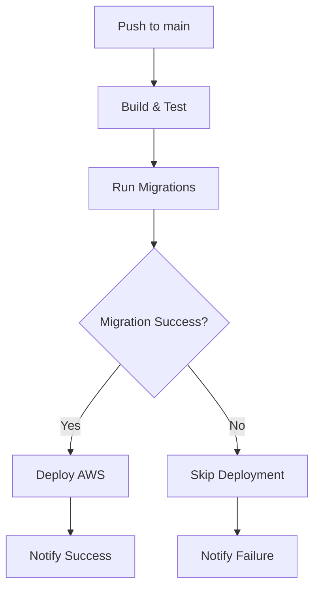

# Supabase Database Migrations Setup Guide

This guide explains how to configure GitHub Actions for automated Supabase database migrations in the TelAgri Bank Dashboard.

## 🎯 Overview

The migration system provides:
- **Automatic migrations** during deployment pipeline
- **Manual migration control** via dedicated workflow
- **Environment-specific configurations** (dev/staging/prod)
- **Safety checks** for destructive operations
- **Rollback capabilities** for error recovery

---

## 🔐 Required GitHub Secrets

Navigate to **Settings → Secrets and variables → Actions → Secrets** and add:

### Core Secrets (Required)

| Secret Name | Description | How to Get |
|-------------|-------------|------------|
| `SUPABASE_ACCESS_TOKEN` | Personal access token for Supabase CLI | [Generate here](https://supabase.com/dashboard/account/tokens) |
| `SUPABASE_PROJECT_ID` | Main project ID (defaults for all environments) | Found in your Supabase project URL |

### Environment-Specific Secrets (Optional)

If you have separate Supabase projects for different environments:

| Secret Name | Description | Example |
|-------------|-------------|---------|
| `SUPABASE_PROJECT_ID_DEV` | Development project ID | `abc123devproject` |
| `SUPABASE_PROJECT_ID_STAGING` | Staging project ID | `def456stagingproject` |
| `SUPABASE_PROJECT_ID_PROD` | Production project ID | `ghi789prodproject` |

**Note**: If environment-specific secrets aren't set, the system will use `SUPABASE_PROJECT_ID` as fallback.

---

## 🔑 Getting Supabase Credentials

### 1. Generate Access Token

1. Go to [Supabase Dashboard](https://supabase.com/dashboard)
2. Click on your profile (top right) → **Account Settings**
3. Navigate to **Access Tokens** tab
4. Click **Generate new token**
5. Give it a name like "GitHub Actions - TelAgri"
6. Copy the token (you won't see it again!)

### 2. Find Project IDs

For each Supabase project:
1. Open your project in Supabase Dashboard
2. Go to **Settings** → **General**
3. Copy the **Project ID** (also visible in the URL: `https://supabase.com/dashboard/project/YOUR_PROJECT_ID`)

---

## 🚀 Migration Workflows

### Automatic Migrations (Main Deployment)

Migrations run automatically when you push to:
- `main` → Production environment
- `staging` → Staging environment  
- `develop` → Development environment

**Pipeline order:**
1. 🏗️ Build & Test
2. 🗄️ **Run Migrations** ← New step!
3. 🚀 Deploy AWS Infrastructure
4. 📢 Notifications

### Manual Migration Control

Use the **🗄️ Database Migrations** workflow for:

#### Available Actions:
- **`push`** - Apply new migrations (safe)
- **`list`** - Check migration status (read-only)
- **`repair`** - Fix migration state issues
- **`reset`** - 🚨 **DESTRUCTIVE** - Removes all data!

#### Running Manual Migrations:
1. Go to **Actions** tab in GitHub
2. Select **🗄️ Database Migrations**
3. Click **Run workflow**
4. Choose environment and action
5. For `reset`: Type "CONFIRM" in confirmation field

---

## 🛡️ Safety Features

### Protection Against Accidents
- **Destructive operations require explicit confirmation**
- **Production resets have additional warnings**
- **Migration failures prevent deployment**
- **Status verification after each operation**

### Error Handling
```bash
# Migration failure → Deployment skipped
🗄️ Migrations: failure ❌
🚀 Deployment: skipped ⏭️
📢 Notification: "Migration failed - deployment skipped"
```

### Rollback Strategy
1. Use `repair` action to fix migration state
2. Create rollback migration files manually
3. Use `reset` + fresh migrations (destructive)

---

## 🔍 Migration Workflow Examples

### Example 1: Normal Deployment
```bash
git add supabase/migrations/20250127000001_add_new_table.sql
git commit -m "feat: add farmer analytics table"
git push origin main
```
**Result**: Migrations apply automatically before AWS deployment

### Example 2: Emergency Migration Fix
1. Go to GitHub Actions
2. Run **🗄️ Database Migrations**
3. Environment: `prod`
4. Action: `repair`
5. Confirm: N/A (non-destructive)

### Example 3: Development Reset
1. Go to GitHub Actions  
2. Run **🗄️ Database Migrations**
3. Environment: `dev`
4. Action: `reset`
5. Confirm: `CONFIRM`

---

## 📋 Migration File Best Practices

### Naming Convention
```bash
# Format: YYYYMMDDHHMMSS_description.sql
20250127120000_add_farmer_analytics_table.sql
20250127120100_update_bank_permissions.sql
```

### Safe Migration Patterns
```sql
-- ✅ GOOD: Additive changes
ALTER TABLE farmers ADD COLUMN analytics_enabled BOOLEAN DEFAULT false;

-- ✅ GOOD: Create new indexes
CREATE INDEX CONCURRENTLY idx_farmers_analytics ON farmers(analytics_enabled);

-- ⚠️ CAREFUL: Dropping columns (data loss)
-- Consider deprecation first
ALTER TABLE farmers DROP COLUMN old_field;

-- 🚨 DANGEROUS: Dropping tables
-- Always backup first
DROP TABLE IF EXISTS deprecated_table;
```

### Transaction Safety
```sql
BEGIN;
  -- Multiple related changes
  ALTER TABLE farmers ADD COLUMN new_field TEXT;
  UPDATE farmers SET new_field = 'default_value' WHERE new_field IS NULL;
  ALTER TABLE farmers ALTER COLUMN new_field SET NOT NULL;
COMMIT;
```

---

## 🔧 Troubleshooting

### Common Issues

#### 1. Authentication Failed
```bash
Error: Failed to authenticate with Supabase
```
**Solution**: Check `SUPABASE_ACCESS_TOKEN` in GitHub secrets

#### 2. Project Not Found
```bash
Error: Project abc123 not found
```
**Solution**: Verify `SUPABASE_PROJECT_ID` matches your project

#### 3. Migration Conflict
```bash
Error: Migration version conflict
```
**Solution**: Use `repair` action or resolve conflicts manually

#### 4. Network Timeout
```bash
Error: Request timeout after 30s
```
**Solution**: Re-run the workflow (temporary issue)

### Debug Steps
1. Check workflow logs in GitHub Actions
2. Verify secrets are set correctly
3. Confirm project ID in Supabase dashboard
4. Test access token with Supabase CLI locally

---

## 🧪 Testing Migration Setup

### Local Testing
```bash
# Install Supabase CLI
npm install -g supabase

# Link to your project
supabase link --project-ref YOUR_PROJECT_ID

# Test migration
supabase db push

# Check status
supabase migration list
```

### Validation Script
Create a local test to verify your setup:

```bash
#!/bin/bash
# test-migration-setup.sh

echo "🧪 Testing Supabase Migration Setup"
echo "=================================="

# Check if required secrets would be available
echo "📋 Required secrets checklist:"
echo "- SUPABASE_ACCESS_TOKEN: ${SUPABASE_ACCESS_TOKEN:+✅ Set / ❌ Missing}"
echo "- SUPABASE_PROJECT_ID: ${SUPABASE_PROJECT_ID:+✅ Set / ❌ Missing}"

# Test CLI connection
if command -v supabase &> /dev/null; then
    echo "✅ Supabase CLI installed"
    supabase --version
else
    echo "❌ Supabase CLI not found"
    echo "Install with: npm install -g supabase"
fi

echo "🔗 Testing connection..."
supabase projects list || echo "❌ Authentication failed"
```

---

## 📊 Monitoring & Observability

### GitHub Actions Logs
- **Migration status** in deployment summary
- **Detailed SQL output** in workflow logs
- **Error messages** with actionable guidance

### Supabase Dashboard
- **Schema changes** visible in Table Editor
- **Migration history** in Database section
- **Performance metrics** for query optimization

### Slack Notifications (Optional)
Add to your workflow for team notifications:
```yaml
- name: 📢 Slack notification
  if: failure()
  uses: 8398a7/action-slack@v3
  with:
    status: failure
    text: "🚨 Database migration failed in ${{ github.event.inputs.environment }}"
  env:
    SLACK_WEBHOOK_URL: ${{ secrets.SLACK_WEBHOOK }}
```

---

## 🔄 Migration Workflow Integration

The migration system integrates seamlessly with your existing deployment:



**Key Benefits:**
- ✅ Database schema always matches application code
- ✅ Failed migrations prevent broken deployments  
- ✅ Environment-specific configurations
- ✅ Manual override capabilities
- ✅ Comprehensive logging and notifications

---

## 📚 Additional Resources

- [Supabase CLI Documentation](https://supabase.com/docs/reference/cli)
- [GitHub Actions Environments](https://docs.github.com/en/actions/deployment/targeting-different-environments)
- [Database Migration Best Practices](https://supabase.com/docs/guides/database/migrations)
- [Supabase API Reference](https://supabase.com/docs/reference/api)

---

**Remember**: Database migrations are critical for financial applications. Always test in development environments first and have rollback plans ready for production changes. 